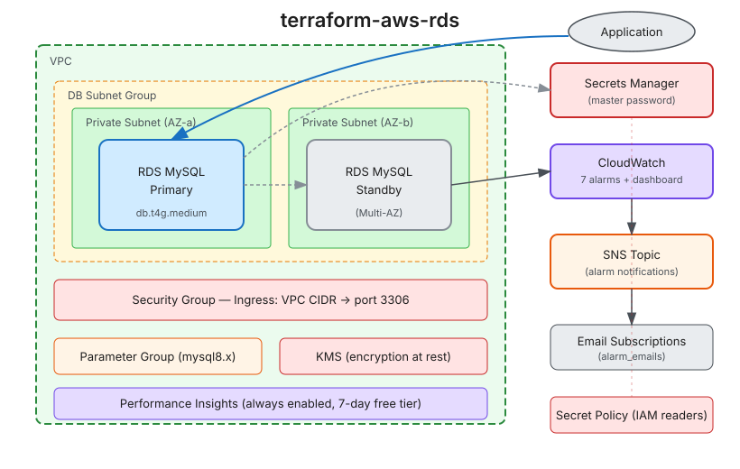

[](https://infrahouse.com/contact)
[](https://infrahouse.github.io/terraform-aws-rds/)
[](https://registry.terraform.io/modules/infrahouse/rds/aws/latest)
[](https://github.com/infrahouse/terraform-aws-rds/releases/latest)
[](https://aws.amazon.com/rds/)
[](https://aws.amazon.com/cloudwatch/)
[](https://github.com/infrahouse/terraform-aws-rds/actions/workflows/vuln-scanner-pr.yml)
[](LICENSE)

# terraform-aws-rds

An opinionated Terraform module for provisioning production-ready AWS RDS MySQL instances with
built-in observability, security hardening, and compliance tagging.

## Features

- **MySQL 8.x** with Performance Insights always enabled
- **CloudWatch alarms** with severity-based routing (urgent/high/normal)
- **PMM-style CloudWatch dashboard** — InnoDB rows, transactions, buffer pool, connections, locks, and more
- **Automatic SNS topic** creation with email subscriptions when explicit topic ARNs aren't provided
- **Storage encryption** (KMS) enabled by default
- **Multi-AZ** deployment by default
- **Vanta compliance tags** for SOC2/ISO27001 audits
- **Security group** with VPC-scoped access and optional CIDR/SG overrides
- **Secrets Manager** integration with configurable IAM reader access
- **Parameter group** family auto-derived from engine version

## Architecture



## Quick Start

```hcl
module "rds" {
  source  = "registry.infrahouse.com/infrahouse/rds/aws"
  version = "0.1.0"

  environment  = "production"
  service_name = "my-app"
  subnet_ids   = module.vpc.private_subnet_ids

  alarm_emails = ["oncall@example.com", "dba@example.com"]
}
```

This creates a `db.t4g.medium` MySQL 8.4 instance with:
- Multi-AZ enabled
- 20 GiB gp3 storage (autoscales to 100 GiB)
- 7 CloudWatch alarms routed to an auto-created SNS topic
- A comprehensive CloudWatch dashboard
- Deletion protection enabled

## Documentation

Full documentation is available at
[infrahouse.github.io/terraform-aws-rds](https://infrahouse.github.io/terraform-aws-rds/).

## Requirements

| Name | Version |
|------|---------|
| terraform | >= 1.5 |
| aws | ~> 6.0 |

## Usage

<!-- BEGIN_TF_DOCS -->

## Requirements

| Name | Version |
|------|---------|
| <a name="requirement_terraform"></a> [terraform](#requirement\_terraform) | >= 1.5 |
| <a name="requirement_aws"></a> [aws](#requirement\_aws) | ~> 6.0 |

## Providers

| Name | Version |
|------|---------|
| <a name="provider_aws"></a> [aws](#provider\_aws) | ~> 6.0 |

## Modules

| Name | Source | Version |
|------|--------|---------|
| <a name="module_secret_policy"></a> [secret\_policy](#module\_secret\_policy) | registry.infrahouse.com/infrahouse/secret-policy/aws | 0.2.1 |

## Resources

| Name | Type |
|------|------|
| [aws_cloudwatch_dashboard.this](https://registry.terraform.io/providers/hashicorp/aws/latest/docs/resources/cloudwatch_dashboard) | resource |
| [aws_cloudwatch_metric_alarm.cpu_utilization](https://registry.terraform.io/providers/hashicorp/aws/latest/docs/resources/cloudwatch_metric_alarm) | resource |
| [aws_cloudwatch_metric_alarm.database_connections](https://registry.terraform.io/providers/hashicorp/aws/latest/docs/resources/cloudwatch_metric_alarm) | resource |
| [aws_cloudwatch_metric_alarm.disk_queue_depth](https://registry.terraform.io/providers/hashicorp/aws/latest/docs/resources/cloudwatch_metric_alarm) | resource |
| [aws_cloudwatch_metric_alarm.free_storage_high](https://registry.terraform.io/providers/hashicorp/aws/latest/docs/resources/cloudwatch_metric_alarm) | resource |
| [aws_cloudwatch_metric_alarm.free_storage_normal](https://registry.terraform.io/providers/hashicorp/aws/latest/docs/resources/cloudwatch_metric_alarm) | resource |
| [aws_cloudwatch_metric_alarm.free_storage_urgent](https://registry.terraform.io/providers/hashicorp/aws/latest/docs/resources/cloudwatch_metric_alarm) | resource |
| [aws_cloudwatch_metric_alarm.freeable_memory](https://registry.terraform.io/providers/hashicorp/aws/latest/docs/resources/cloudwatch_metric_alarm) | resource |
| [aws_db_instance.this](https://registry.terraform.io/providers/hashicorp/aws/latest/docs/resources/db_instance) | resource |
| [aws_db_parameter_group.this](https://registry.terraform.io/providers/hashicorp/aws/latest/docs/resources/db_parameter_group) | resource |
| [aws_db_subnet_group.this](https://registry.terraform.io/providers/hashicorp/aws/latest/docs/resources/db_subnet_group) | resource |
| [aws_iam_role.rds_monitoring](https://registry.terraform.io/providers/hashicorp/aws/latest/docs/resources/iam_role) | resource |
| [aws_iam_role_policy_attachment.rds_monitoring](https://registry.terraform.io/providers/hashicorp/aws/latest/docs/resources/iam_role_policy_attachment) | resource |
| [aws_secretsmanager_secret_policy.master](https://registry.terraform.io/providers/hashicorp/aws/latest/docs/resources/secretsmanager_secret_policy) | resource |
| [aws_security_group.this](https://registry.terraform.io/providers/hashicorp/aws/latest/docs/resources/security_group) | resource |
| [aws_sns_topic.alarms](https://registry.terraform.io/providers/hashicorp/aws/latest/docs/resources/sns_topic) | resource |
| [aws_sns_topic_subscription.email](https://registry.terraform.io/providers/hashicorp/aws/latest/docs/resources/sns_topic_subscription) | resource |
| [aws_vpc_security_group_ingress_rule.cidrs](https://registry.terraform.io/providers/hashicorp/aws/latest/docs/resources/vpc_security_group_ingress_rule) | resource |
| [aws_vpc_security_group_ingress_rule.security_groups](https://registry.terraform.io/providers/hashicorp/aws/latest/docs/resources/vpc_security_group_ingress_rule) | resource |
| [aws_ec2_instance_type.this](https://registry.terraform.io/providers/hashicorp/aws/latest/docs/data-sources/ec2_instance_type) | data source |
| [aws_iam_policy_document.rds_monitoring_assume](https://registry.terraform.io/providers/hashicorp/aws/latest/docs/data-sources/iam_policy_document) | data source |
| [aws_region.current](https://registry.terraform.io/providers/hashicorp/aws/latest/docs/data-sources/region) | data source |
| [aws_secretsmanager_secret.master](https://registry.terraform.io/providers/hashicorp/aws/latest/docs/data-sources/secretsmanager_secret) | data source |
| [aws_subnet.first](https://registry.terraform.io/providers/hashicorp/aws/latest/docs/data-sources/subnet) | data source |
| [aws_vpc.this](https://registry.terraform.io/providers/hashicorp/aws/latest/docs/data-sources/vpc) | data source |

## Inputs

| Name | Description | Type | Default | Required |
|------|-------------|------|---------|:--------:|
| <a name="input_alarm_connections_evaluation_periods"></a> [alarm\_connections\_evaluation\_periods](#input\_alarm\_connections\_evaluation\_periods) | Connections alarm evaluation periods | `number` | `2` | no |
| <a name="input_alarm_connections_period"></a> [alarm\_connections\_period](#input\_alarm\_connections\_period) | Connections alarm period in seconds | `number` | `300` | no |
| <a name="input_alarm_connections_threshold"></a> [alarm\_connections\_threshold](#input\_alarm\_connections\_threshold) | Max database connections threshold (null = 80% of instance max) | `number` | `null` | no |
| <a name="input_alarm_cpu_evaluation_periods"></a> [alarm\_cpu\_evaluation\_periods](#input\_alarm\_cpu\_evaluation\_periods) | CPU alarm evaluation periods | `number` | `2` | no |
| <a name="input_alarm_cpu_period"></a> [alarm\_cpu\_period](#input\_alarm\_cpu\_period) | CPU alarm period in seconds | `number` | `300` | no |
| <a name="input_alarm_cpu_threshold"></a> [alarm\_cpu\_threshold](#input\_alarm\_cpu\_threshold) | CPU utilization % threshold | `number` | `80` | no |
| <a name="input_alarm_disk_queue_depth_threshold"></a> [alarm\_disk\_queue\_depth\_threshold](#input\_alarm\_disk\_queue\_depth\_threshold) | Disk queue depth threshold | `number` | `64` | no |
| <a name="input_alarm_disk_queue_evaluation_periods"></a> [alarm\_disk\_queue\_evaluation\_periods](#input\_alarm\_disk\_queue\_evaluation\_periods) | Disk queue alarm evaluation periods | `number` | `3` | no |
| <a name="input_alarm_disk_queue_period"></a> [alarm\_disk\_queue\_period](#input\_alarm\_disk\_queue\_period) | Disk queue alarm period in seconds | `number` | `300` | no |
| <a name="input_alarm_emails"></a> [alarm\_emails](#input\_alarm\_emails) | Email addresses for alarm notifications (used when notifications is not set) | `list(string)` | n/a | yes |
| <a name="input_alarm_memory_evaluation_periods"></a> [alarm\_memory\_evaluation\_periods](#input\_alarm\_memory\_evaluation\_periods) | Memory alarm evaluation periods | `number` | `2` | no |
| <a name="input_alarm_memory_percent"></a> [alarm\_memory\_percent](#input\_alarm\_memory\_percent) | Freeable memory threshold as % of total instance memory | `number` | `5` | no |
| <a name="input_alarm_memory_period"></a> [alarm\_memory\_period](#input\_alarm\_memory\_period) | Memory alarm period in seconds | `number` | `900` | no |
| <a name="input_alarm_storage_evaluation_periods"></a> [alarm\_storage\_evaluation\_periods](#input\_alarm\_storage\_evaluation\_periods) | Storage alarm evaluation periods | `number` | `1` | no |
| <a name="input_alarm_storage_percent_high"></a> [alarm\_storage\_percent\_high](#input\_alarm\_storage\_percent\_high) | Free storage % threshold for high alarm | `number` | `10` | no |
| <a name="input_alarm_storage_percent_normal"></a> [alarm\_storage\_percent\_normal](#input\_alarm\_storage\_percent\_normal) | Free storage % threshold for normal alarm | `number` | `20` | no |
| <a name="input_alarm_storage_percent_urgent"></a> [alarm\_storage\_percent\_urgent](#input\_alarm\_storage\_percent\_urgent) | Free storage % threshold for urgent alarm | `number` | `5` | no |
| <a name="input_alarm_storage_period"></a> [alarm\_storage\_period](#input\_alarm\_storage\_period) | Storage alarm period in seconds | `number` | `300` | no |
| <a name="input_allocated_storage"></a> [allocated\_storage](#input\_allocated\_storage) | Initial storage in GiB | `number` | `20` | no |
| <a name="input_allowed_cidrs"></a> [allowed\_cidrs](#input\_allowed\_cidrs) | CIDR blocks allowed to connect to RDS (defaults to the VPC CIDR) | `list(string)` | `null` | no |
| <a name="input_allowed_security_group_ids"></a> [allowed\_security\_group\_ids](#input\_allowed\_security\_group\_ids) | Additional security group IDs allowed to connect to RDS | `list(string)` | `[]` | no |
| <a name="input_apply_immediately"></a> [apply\_immediately](#input\_apply\_immediately) | Apply changes immediately vs. maintenance window | `bool` | `true` | no |
| <a name="input_backup_retention_period"></a> [backup\_retention\_period](#input\_backup\_retention\_period) | Days to retain automated backups | `number` | `7` | no |
| <a name="input_backup_window"></a> [backup\_window](#input\_backup\_window) | Preferred backup window | `string` | `"02:00-02:30"` | no |
| <a name="input_db_name"></a> [db\_name](#input\_db\_name) | Database name to create on launch | `string` | `null` | no |
| <a name="input_deletion_protection"></a> [deletion\_protection](#input\_deletion\_protection) | Enable deletion protection | `bool` | `true` | no |
| <a name="input_engine_version"></a> [engine\_version](#input\_engine\_version) | MySQL engine version | `string` | `"8.4"` | no |
| <a name="input_environment"></a> [environment](#input\_environment) | Environment name (lowercase, underscores only) | `string` | n/a | yes |
| <a name="input_identifier_prefix"></a> [identifier\_prefix](#input\_identifier\_prefix) | Identifier prefix for the RDS instance (auto-generated if null) | `string` | `null` | no |
| <a name="input_instance_class"></a> [instance\_class](#input\_instance\_class) | RDS instance class | `string` | `"db.t4g.medium"` | no |
| <a name="input_kms_key_id"></a> [kms\_key\_id](#input\_kms\_key\_id) | KMS key ARN for storage encryption (null = AWS managed key) | `string` | `null` | no |
| <a name="input_long_query_time"></a> [long\_query\_time](#input\_long\_query\_time) | Threshold in seconds for slow query logging | `number` | `1` | no |
| <a name="input_maintenance_window"></a> [maintenance\_window](#input\_maintenance\_window) | Preferred maintenance window | `string` | `"Mon:03:00-Mon:04:00"` | no |
| <a name="input_max_allocated_storage"></a> [max\_allocated\_storage](#input\_max\_allocated\_storage) | Max storage for autoscaling in GiB | `number` | `100` | no |
| <a name="input_multi_az"></a> [multi\_az](#input\_multi\_az) | Enable Multi-AZ deployment | `bool` | `true` | no |
| <a name="input_notifications"></a> [notifications](#input\_notifications) | SNS topic ARNs per severity tier (overrides alarm\_emails when set) | <pre>object({<br/>    urgent = optional(string)<br/>    high   = optional(string)<br/>    normal = optional(string)<br/>  })</pre> | `{}` | no |
| <a name="input_parameter_group_family"></a> [parameter\_group\_family](#input\_parameter\_group\_family) | DB parameter group family (null = derived from engine\_version) | `string` | `null` | no |
| <a name="input_parameters"></a> [parameters](#input\_parameters) | Additional DB parameters (merged with module defaults) | <pre>list(object({<br/>    name  = string<br/>    value = string<br/>  }))</pre> | `[]` | no |
| <a name="input_performance_insights_retention_period"></a> [performance\_insights\_retention\_period](#input\_performance\_insights\_retention\_period) | Performance Insights retention in days (7 = free tier, 31-731 = paid) | `number` | `7` | no |
| <a name="input_port"></a> [port](#input\_port) | Database port | `number` | `3306` | no |
| <a name="input_read_only"></a> [read\_only](#input\_read\_only) | Set the database to read-only mode (immediate, no reboot) | `bool` | `false` | no |
| <a name="input_secret_readers"></a> [secret\_readers](#input\_secret\_readers) | IAM ARNs allowed to read the master password secret | `list(string)` | `[]` | no |
| <a name="input_server_audit_events"></a> [server\_audit\_events](#input\_server\_audit\_events) | Comma-separated list of audit events to log (empty string disables audit logging) | `string` | `"CONNECT,QUERY_DCL,QUERY_DDL"` | no |
| <a name="input_service_name"></a> [service\_name](#input\_service\_name) | Service name (used in naming and tags) | `string` | n/a | yes |
| <a name="input_skip_final_snapshot"></a> [skip\_final\_snapshot](#input\_skip\_final\_snapshot) | Skip final snapshot on deletion | `bool` | `false` | no |
| <a name="input_storage_type"></a> [storage\_type](#input\_storage\_type) | Storage type (gp3, io1, io2) | `string` | `"gp3"` | no |
| <a name="input_subnet_ids"></a> [subnet\_ids](#input\_subnet\_ids) | Private subnet IDs for the DB subnet group (VPC derived from first subnet) | `list(string)` | n/a | yes |
| <a name="input_tags"></a> [tags](#input\_tags) | Additional tags to merge | `map(string)` | `{}` | no |
| <a name="input_username"></a> [username](#input\_username) | Master username | `string` | `"admin"` | no |
| <a name="input_vanta_contains_ephi"></a> [vanta\_contains\_ephi](#input\_vanta\_contains\_ephi) | VantaContainsEPHI | `bool` | `false` | no |
| <a name="input_vanta_contains_user_data"></a> [vanta\_contains\_user\_data](#input\_vanta\_contains\_user\_data) | VantaContainsUserData | `bool` | `true` | no |
| <a name="input_vanta_description"></a> [vanta\_description](#input\_vanta\_description) | VantaDescription | `string` | `"RDS MySQL database"` | no |
| <a name="input_vanta_non_prod"></a> [vanta\_non\_prod](#input\_vanta\_non\_prod) | VantaNonProd (null = derived from environment) | `bool` | `null` | no |
| <a name="input_vanta_owner"></a> [vanta\_owner](#input\_vanta\_owner) | VantaOwner tag value (defaults to service\_name) | `string` | `null` | no |
| <a name="input_vanta_user_data_stored"></a> [vanta\_user\_data\_stored](#input\_vanta\_user\_data\_stored) | VantaUserDataStored (description of what user data) | `string` | `null` | no |

## Outputs

| Name | Description |
|------|-------------|
| <a name="output_dashboard_name"></a> [dashboard\_name](#output\_dashboard\_name) | Name of the CloudWatch dashboard |
| <a name="output_db_instance_address"></a> [db\_instance\_address](#output\_db\_instance\_address) | Hostname of the RDS instance |
| <a name="output_db_instance_arn"></a> [db\_instance\_arn](#output\_db\_instance\_arn) | The RDS instance ARN |
| <a name="output_db_instance_endpoint"></a> [db\_instance\_endpoint](#output\_db\_instance\_endpoint) | Connection endpoint (host:port) |
| <a name="output_db_instance_id"></a> [db\_instance\_id](#output\_db\_instance\_id) | The RDS instance identifier |
| <a name="output_db_instance_name"></a> [db\_instance\_name](#output\_db\_instance\_name) | The database name |
| <a name="output_db_instance_port"></a> [db\_instance\_port](#output\_db\_instance\_port) | Port of the RDS instance |
| <a name="output_db_instance_username"></a> [db\_instance\_username](#output\_db\_instance\_username) | The master username |
| <a name="output_db_subnet_group_name"></a> [db\_subnet\_group\_name](#output\_db\_subnet\_group\_name) | Name of the DB subnet group |
| <a name="output_master_secret_arn"></a> [master\_secret\_arn](#output\_master\_secret\_arn) | ARN of the Secrets Manager secret holding the master password |
| <a name="output_parameter_group_name"></a> [parameter\_group\_name](#output\_parameter\_group\_name) | Name of the DB parameter group |
| <a name="output_security_group_id"></a> [security\_group\_id](#output\_security\_group\_id) | ID of the security group created for the RDS instance |
<!-- END_TF_DOCS -->

## Examples

See the [examples/](examples/) directory for complete working configurations.

## Contributing

Contributions are welcome! Please see [CONTRIBUTING.md](CONTRIBUTING.md) for guidelines.

## License

Apache 2.0 — see [LICENSE](LICENSE) for details.
