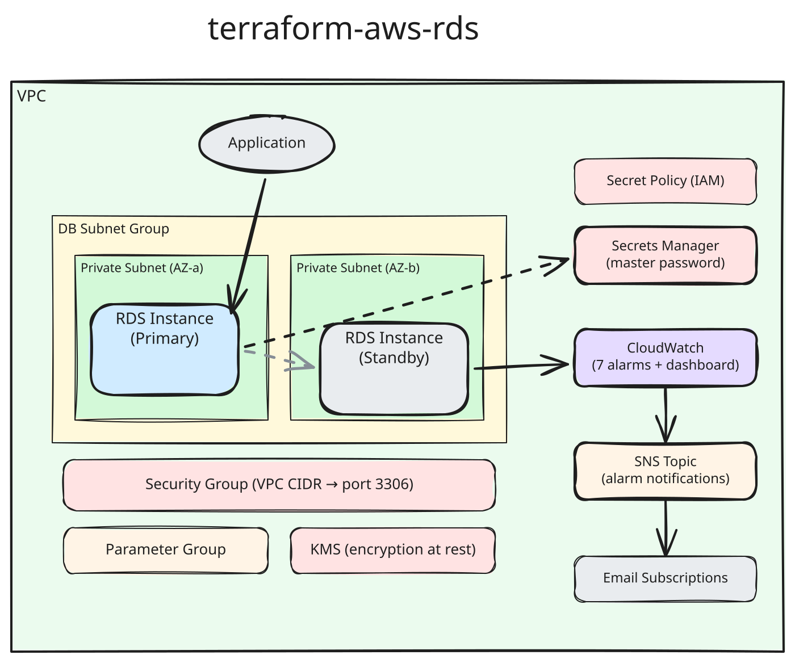

# Architecture

## How It Works

## Design Decisions

### Performance Insights Always On

PI is hardcoded to enabled because:

- The 7-day retention is free on supported instance classes
- It's essential for diagnosing production issues
- The module defaults to `db.t4g.medium`, the smallest PI-compatible class for MySQL 8.4 and PostgreSQL 18

### Severity-Based Alarm Routing

Alarms are categorized by operational impact:

| Severity | Alarms | Default Response |
|----------|--------|-----------------|
| **Urgent** | Storage < 5% | Immediate action required |
| **High** | CPU > 80%, Memory < 5%, Storage < 10%, Connections near max | Investigate within hours |

The connections alarm fires at 80% of the engine's default `max_connections`, estimated from instance memory:
`memory / 12582880` for MySQL and `LEAST(memory / 9531392, 5000)` for PostgreSQL. Override it with
`alarm_connections_threshold` if you change `max_connections`.
| **Normal** | Storage < 20%, Disk queue depth | Awareness, plan remediation |

### Auto-Created SNS Topic

When users don't provide explicit SNS topic ARNs, the module creates one topic and subscribes
all `alarm_emails`. This ensures alarms are never silent — a common misconfiguration when
teams set up monitoring but forget to wire up notifications.

### One Module, Two Engines

`engine` selects MySQL or PostgreSQL. Everything that differs between them lives in one per-engine map in
`locals.tf`: default version, port, master username, parameter group family, CloudWatch log exports,
the parameters the module sets, and the `max_connections` formula. The subnet group, instance settings,
security group, secrets, Enhanced Monitoring, alarms, and SNS wiring are shared.

| | MySQL | PostgreSQL |
|---|---|---|
| Default version | `8.4` | `18` |
| Port | `3306` | `5432` |
| Master username | `admin` | `postgres` |
| Log exports | `error`, `slowquery` | `postgresql`, `upgrade` |
| Slow query logging | `long_query_time` | `log_min_duration_statement` |

### Parameter Group Family Derivation

The parameter group family is automatically derived from `engine` and `engine_version`:
`mysql` + major.minor (`8.4.3` → `mysql8.4`) and `postgres` + major (`18.6` → `postgres18`).
This prevents the common misconfiguration where someone upgrades the engine version but forgets
to update the parameter group family.

### Managed Master Password

The module uses `manage_master_user_password = true`, which means:

- AWS creates and manages the password in Secrets Manager
- The password is never exposed in Terraform state
- Automatic rotation is handled by RDS
- Access to the secret is controlled via `secret_readers` variable

### Storage Encryption

Always enabled (`storage_encrypted = true`). Uses AWS-managed key by default,
or a customer-managed KMS key if `kms_key_id` is provided.

## CloudWatch Dashboard

Each engine gets its own Performance Insights panels, followed by the same system panels.

**MySQL** (PMM-style):

1. **Header** — QPS, Free Storage, Threads Running, Connections
2. **Connections** — Threads_connected with max_connections line, Aborted connections
3. **Client Threads** — Running vs Connected/Created
4. **Temporary Objects** — tmp_tables vs tmp_disk_tables, Slow queries
5. **Select Types** — full_join, scan, range
6. **Sorts** — rows, merge_passes, scan
7. **Table Locks** — immediate vs waited, Questions & Queries
8. **InnoDB Row Operations** — rows read/inserted/updated/deleted
9. **InnoDB Transactions** — active transactions and history list length
10. **Buffer Pool & Table Cache** — hit rate, usage, opened tables

**PostgreSQL**:

1. **Header** — Commits per second, Free Storage, Active Transactions, Connections
2. **Connections** — numbackends with max_connections line, connection attempts
3. **Transactions** — commits vs rollbacks; active, blocked, and idle-in-transaction sessions
4. **Tuples & Deadlocks** — tuples returned/fetched/inserted/updated/deleted, deadlocks
5. **Buffer Cache & Read Time** — blocks hit in cache vs read from disk, time spent reading blocks
6. **Checkpoints** — timed vs requested, write and sync time
7. **Temporary Files & Transaction ID Age** — temp files and bytes; unvacuumed transactions and
   oldest running transaction age (wraparound risk)

**Both engines**:

1. **Network & IOPS** — throughput and read/write IOPS
2. **CPU & Memory** — utilization with alarm thresholds
3. **Disk Queue & Storage** — queue depth and free space with alarm thresholds (in GiB)
4. **Read/Write Latency** — I/O latency

All PI-based widgets use `DB_PERF_INSIGHTS` math expressions, which require the instance
to have Performance Insights enabled. Counter names follow the AWS
[Performance Insights counter metrics][pi-counters]
reference, except for the PostgreSQL checkpoint counters. Those use the PostgreSQL 17+ names
(`db.Checkpoint.num_timed`, `db.Checkpoint.write_time`, ...) that a postgres 18 instance reports, so on
PostgreSQL 16 and older the checkpoint panels stay empty.

[pi-counters]: https://docs.aws.amazon.com/AmazonRDS/latest/UserGuide/USER_PerfInsights_Counters.html
